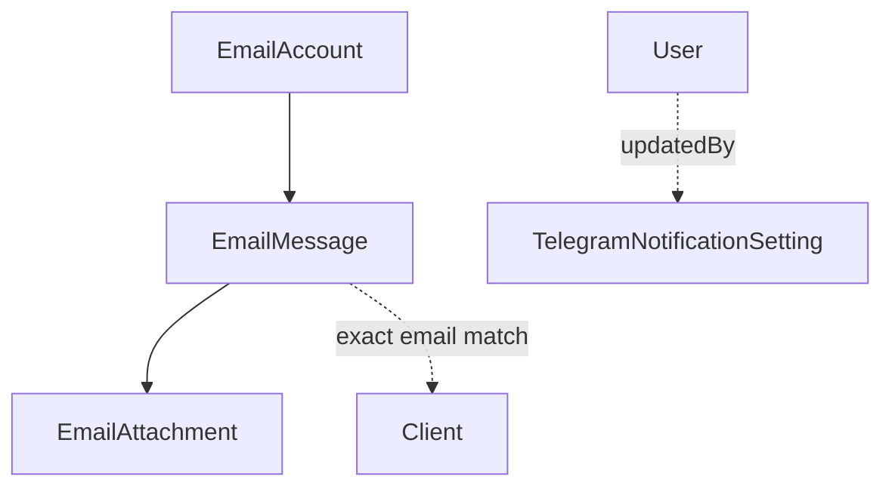

# Communication Domain

## Purpose

Staff email mailbox integration (IMAP sync + SMTP send) linked to clients, an Instagram webhook
endpoint, and outbound Telegram notifications for staff with admin-controlled on/off switches.

## Scope

- `EmailAccount`, `EmailMessage`, `EmailAttachment`.
- Instagram webhook handling (`modules/communication/instagram/instagram.controller.ts`).
- Telegram staff notifications (`modules/communication/telegram/`): sending
  (`telegram.service.ts`, `new-record-notifications.service.ts`) and the per-type switches
  (`TelegramNotificationSetting`, `notification-settings.*`). Full contract:
  [DDC_CRM_TELEGRAM_NOTIFICATIONS_SPEC.md](../spec/DDC_CRM_TELEGRAM_NOTIFICATIONS_SPEC.md).

## Out of Scope

- **Invoice delivery email** — Billing has its own independent SMTP transport
  (`modules/invoices/invoices.delivery.service.ts`, built directly from env vars), sharing no code
  with this module; invoice emails never create an `EmailMessage` row here.
- **2FA email** — Identity sends 2FA codes directly via nodemailer using the `EmailAccount` whose
  `username` matches `TWO_FACTOR_SENDER_EMAIL`, bypassing this module's send path and not creating
  an `EmailMessage`.
- **Payment reminder email content** — templated and sent by the Payments domain
  (`PaymentReminderTemplate`).

## Entities

### EmailAccount

- **Purpose**: a staff-configured IMAP+SMTP mailbox.
- **Identity**: `id`.
- **Important fields**: `imapHost`/`imapPort`/`smtpHost`/`smtpPort`, `username`,
  `passwordEncrypted`, `lastSyncedUid`/`lastSyncedAt` (sync cursor).
- **Invariants**: the entire `/email` API is `ADMIN`-only (Identity-domain rule enforced at the
  router level) — `MANAGER`/`DOCTOR` staff cannot access email at all.

### EmailMessage

- **Purpose**: one email, inbound or outbound.
- **Identity**: `id`; unique on `(mailboxId, imapUid)`.
- **Important fields**: `isOutgoing`, `isRead` (outgoing mail is always written as read),
  `fromAddress`, `replyToAddress` (the Reply-To header when it differs from From — a website
  contact form sends as the site and names the visitor there), `clientId` (optional),
  `messageId`/`inReplyToMessageId` (stored from the IMAP envelope, but not used to group/display
  threads in the reviewed code).
- **Contact address**: `replyToAddress ?? fromAddress`. Replies, the CRM client match and the AI
  assistant's sender all use it.
- **Relationships**: `EmailAccount` (mailbox), optional `Client` — associated by **exact email
  address match** only (`Client.email === contact address`), nothing fuzzier.
- **Invariants**: deletion is a two-step process, not a plain cascade — attachment files are
  removed from disk explicitly before the DB row delete (which then cascades `EmailAttachment`
  rows). Delete/spam actions first attempt to move the message on the IMAP server, unless it's an
  outgoing message that never existed there.

### EmailAttachment

- **Purpose**: a file attached to an `EmailMessage`.
- **Identity**: `id`.
- **Important fields**: `storagePath` — files are stored under a **UUID filename**, deliberately
  decoupled from the original filename to avoid path traversal (same pattern used for client image
  uploads in the CRM domain).

### TelegramNotificationSetting

- **Purpose**: the on/off state of one Telegram notification type.
- **Identity**: `key` — the notification type's code key (e.g. `MOLLIE_PAYMENT`, `NEW_STUDENT`),
  not a generated id.
- **Important fields**: `enabled`, `updatedById` (the admin who last changed it).
- **Relationships**: optional `User` (`updatedBy`, set null if the user is deleted).
- **Invariants**: a row exists **only after an admin has changed a switch** — the set of types
  and each type's default live in code (`TELEGRAM_NOTIFICATION_DEFINITIONS`), so adding a type
  needs no data migration. A missing row and a failed read both resolve to the type's default.
  Reading and writing are `ADMIN`-only.

## Domain Concepts

- **IMAP sync**: runs on a 5-minute cron plus a manual per-account trigger; both funnel through the
  same sync function, which guards against overlapping runs on the same account. Fetches only UIDs
  newer than `lastSyncedUid`, upserts each into `EmailMessage`, and advances the sync cursor to the
  highest UID seen — even on partial failure within the batch.
- **Sending**: composing or replying sends via nodemailer using the target mailbox's own SMTP
  credentials, then synchronously writes the `EmailMessage` row in the same call. A reply always
  goes out through the mailbox that received the original message, not an arbitrary sender.
- **Encryption scope**: `EmailAccount.passwordEncrypted` is AES-256-GCM encrypted at rest. Message
  bodies (`bodyText`/`bodyHtml`) and attachment files are stored **unencrypted** (attachments are
  kept outside the public static mount, but not encrypted).
- **Instagram — stub, not a working feature**: the webhook handshake (GET, HMAC-verified) is
  functional, but the message-receiving handler only logs incoming events — it does not persist
  anything or associate with a `Client`. Document as scaffolding, not active client communication.
  It's also the only fully unauthenticated, CSRF-exempt API surface besides `/health`.
- **Telegram — internal ops notification, not a customer channel**: seven notification types,
  each a `notify*()` function that is fire-and-forget (a Telegram send failure never affects the
  triggering action's own response). Callers span four domains: Payments (Mollie webhook:
  paid/failed/canceled/expired/chargeback/refund; a new Mollie customer created in the CRM or by
  a sync), Identity (login-blocked, new-device-after-failures, role-changed), CRM (a new student)
  and this module's own IMAP sync (new non-spam email). Two distinct recipients, not one:
  `TELEGRAM_CHAT_ID` (the shared admin group — every type except new email) vs.
  `TELEGRAM_EMAIL_NOTIFY_CHAT_ID` (one admin's own private chat with the bot —
  `sendTelegramMessage`'s `chatId` option overrides the group default). This is a separate
  integration from the Telegram Mini App admin tool (`auth/telegram-miniapp/` +
  `telegram-admin-bot/`, documented in [identity.md](identity.md) — Mini App auth is genuinely
  Identity's concern) and from Telegram OIDC login (also identity.md).
- **A notification is sent only when two things hold**: the recipient chat for its type is
  configured in the environment, and its switch is on (`canSendNotification(key)` in
  `telegram.service.ts`). The five older types default to on; the six student and Mollie record
  types (new and deleted student, new and deleted Mollie customer, mandates, subscriptions)
  default to off, so a release never changes what the group receives until an admin opts in.
- **Switch changes are themselves announced**: every actual change is posted to the
  `TELEGRAM_CHAT_ID` group by `notifyNotificationSettingChanged`, which deliberately has no
  switch of its own — notifications, security ones included, cannot be silenced without the
  group seeing it. There is no separate change log in the CRM; the group chat is the history.
- **New-record notifications** (`telegram/new-record-notifications.service.ts`): a new student is
  announced from `clients.service.createClient` after its transaction commits, so every creation
  path (CRM form, Telegram Mini App) is covered. A new Mollie customer is announced from the CRM
  create path and from `payments.sync.service`; a sync run that creates more than three customers
  sends one summary instead of one message each. Messages go to a group chat, so they carry the
  name and a CRM link but no contact or bank details.
- **Record lifecycle notifications** (`telegram/record-lifecycle-notifications.service.ts`): a
  deleted student is announced from `clients.service.deleteClient`; a deleted Mollie customer, a
  created or revoked mandate, and a created, cancelled or restarted subscription are announced
  from `payments.controller` once Mollie and the database have accepted the change. Mandates and
  subscriptions that first reach the CRM through `payments.sync.service` are announced with the
  same more-than-three-becomes-a-summary rule. Editing a subscription, which may replace it on
  Mollie, is not announced. Deletion messages carry no link — the card no longer exists — and no
  message carries an IBAN.
- **Admin page**: the switches are managed on the `/notifications` page (sidebar → Компания →
  Уведомления), visible to `ADMIN` only; a click saves immediately.

## Relationships

